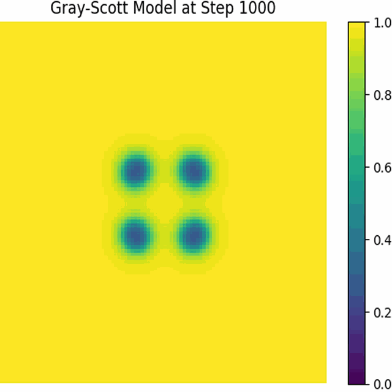

# grayscott
Here is a versy simple Simple grayscott simulation !!


# What is needed ? 
You should have a recent `cmake` version and a `OpenMP` friendly compiler. 


# Compilation and execution
```
mkdir build
cd build
cmake ..
make -j 
./grayscott
```

# Generate the resulting animation
The `gray-Scott` simulation generate some `.txt` files. You can generate a `.gif` and a `mp4` files of it ! 
Here are the commands : 

```
pip install  pillow imageio
cd build
python ../src/python/*.py
```

Here is the resut ! 



